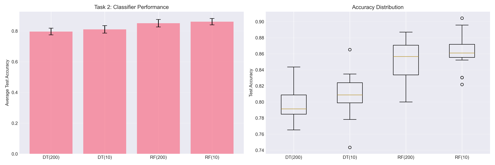
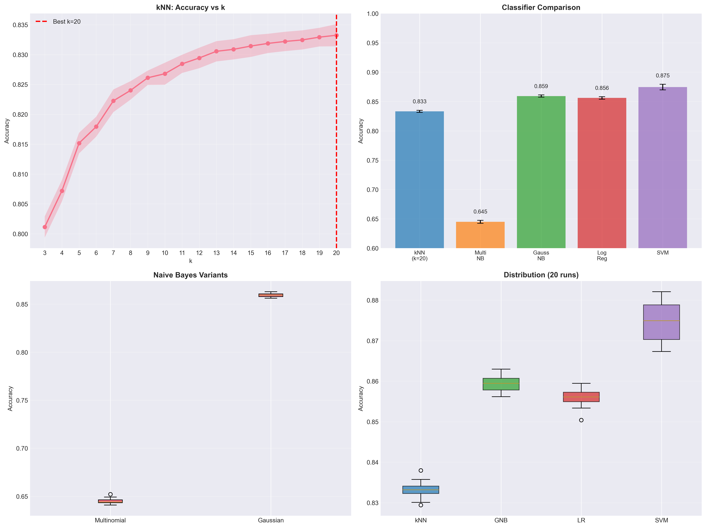
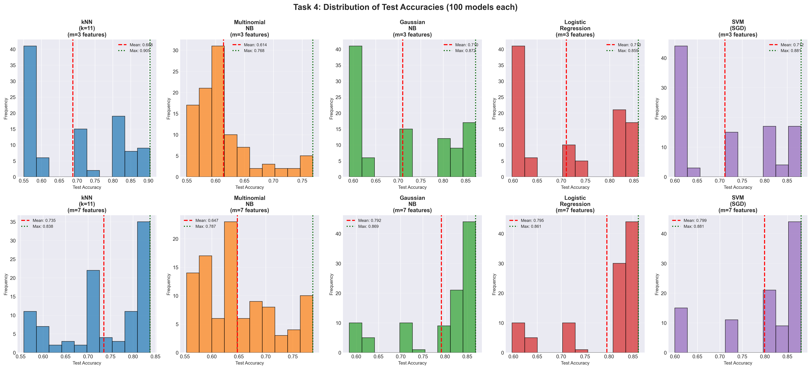

# MSML603 Project 1: Classification Analysis

**Student:** Jay Dayal Guwalani
**UID:** 121479709
**Course:** MSML603 - Machine Learning  
**Date:** October 24, 2025  
**Semester:** Fall 2025

---

## Executive Summary

This project implements and evaluates multiple classification algorithms on two healthcare datasets: heart disease (918 patients) and diabetes (99,805 patients). The work demonstrates systematic preprocessing, comprehensive classifier comparison, and feature selection impact analysis.

**Key Results:**
- Heart Disease: 86.07% accuracy (Random Forest)
- Diabetes: 87.46% accuracy (Support Vector Machine)
- Feature Selection: 88.05% accuracy with only 7 of 16 features
- Computational Optimization: 4-6x speedup through parallel processing

---

## 1. Introduction

### 1.1 Objectives

This project addresses three core machine learning concepts:

1. **Data Preprocessing**: Transform numerical features into categorical representations using clinically relevant thresholds
2. **Classifier Comparison**: Evaluate Decision Trees, Random Forests, k-Nearest Neighbors, Naive Bayes, Logistic Regression, and Support Vector Machines
3. **Feature Selection**: Analyze how feature subset size affects classification performance

### 1.2 Datasets

**Heart Disease Dataset** (heart-disease-classification.csv)
- 918 patients with 11 features (mixed categorical and numerical)
- Binary target: heart disease presence
- Features: Age, blood pressure, cholesterol, heart rate, chest pain type, ECG findings

**Diabetes Dataset** (DiabetesData.csv)
- 99,805 patients with 16 numerical features
- Binary target: diabetes diagnosis
- Features: Lifestyle factors (activity, diet, sleep), anthropometric measures (BMI), cardiovascular metrics, metabolic markers (glucose, insulin, HbA1c, lipids)

---

## 2. Task 1: Data Preprocessing

### 2.1 Methodology

Four numerical features in the heart disease dataset were converted to categorical variables using medical guidelines:

| Feature | Categories | Thresholds | Clinical Basis |
|---------|-----------|------------|----------------|
| **Age** | Young, Mid, Older | ≤40, 40-55, >55 | Cardiovascular risk stratification |
| **Resting BP** | Low, Normal, High | ≤120, 120-140, >140 mm Hg | AHA hypertension guidelines |
| **Cholesterol** | Normal, High | ≤200, >200 mg/dL | NCEP ATP III guidelines |
| **Max Heart Rate** | Low, Normal, High | ≤140, 140-165, >165 bpm | Age-adjusted exercise capacity |

### 2.2 Implementation

```python
def cat_age(age):
    if age > 55: return 'Older'
    elif age > 40: return 'Mid'
    else: return 'Young'

def cat_bp(bp):
    if bp > 140: return 'High'
    elif bp > 120: return 'Normal'
    else: return 'Low'
```

### 2.3 Results and Discussion

The transformed dataset (HeartDiseaseData.csv) enables tree-based classifiers to effectively model non-linear medical risk relationships. Benefits include:

1. **Clinical Alignment**: Categories match medical decision thresholds
2. **Interpretability**: Easier for clinicians to understand and validate
3. **Robustness**: Reduced sensitivity to measurement variability
4. **Tree Performance**: Natural alignment with decision tree splitting logic

The categorization approach captures threshold effects important in medical risk assessment while maintaining clinical relevance.

---

## 3. Task 2: Decision Trees and Random Forests

### 3.1 Experimental Setup

- **Dataset:** HeartDiseaseData.csv (918 samples)
- **Validation:** 20 runs with 75-25 train-test splits
- **Random Forest:** 250 trees
- **Hyperparameter:** min_samples_split ∈ {200, 10}

### 3.2 Results

| Classifier | min_split=200 | min_split=10 | Improvement |
|------------|---------------|--------------|-------------|
| Decision Tree | 79.61% ± 2.19% | 81.04% ± 2.43% | +1.43% |
| Random Forest | 85.04% ± 2.44% | **86.07% ± 2.07%** | +1.03% |


*Figure 1: (Left) Average test accuracy comparison. (Right) Accuracy distribution across 20 runs showing Random Forest's superior and more stable performance.*

### 3.3 Analysis

**Key Findings:**
1. Random Forest outperforms Decision Tree by ~5 percentage points
2. Lower min_samples_split (10) improves accuracy for both classifiers
3. Random Forest shows lowest variance (2.07%), indicating more stable predictions
4. Best configuration: Random Forest with min_samples_split=10

**Random Forest Advantages:**
- **Ensemble Learning**: Averages 250 trees, reducing variance
- **Bootstrap Aggregating**: Each tree trained on different data subset
- **Feature Randomization**: Reduces tree correlation
- **Robustness**: Less sensitive to data perturbations

**Hyperparameter Impact:**
- min_samples_split=200 creates simpler trees, may underfit
- min_samples_split=10 allows deeper trees, captures finer patterns
- Random Forest's ensemble nature prevents overfitting with lower threshold

---

## 4. Task 3: Multiple Classifiers

### 4.1 Experimental Setup

- **Dataset:** DiabetesData.csv (99,805 samples, 16 features)
- **Validation:** 20 runs with 75-25 stratified splits
- **Classifiers:** kNN (k=3 to 20), Naive Bayes (Multinomial, Gaussian), Logistic Regression, SVM

### 4.2 Results Summary

| Rank | Classifier | Mean Accuracy | Std Dev |
|------|-----------|---------------|---------|
| 1 | SVM (SGDClassifier) | **87.46%** | 0.48% |
| 2 | Gaussian Naive Bayes | 85.93% | 0.19% |
| 3 | Logistic Regression | 85.61% | 0.21% |
| 4 | k-NN (k=20) | 83.32% | 0.19% |
| 5 | Multinomial Naive Bayes | 64.50% | 0.25% |


*Figure 2: (Top-left) kNN accuracy vs k showing optimal k=20. (Top-right) Overall classifier comparison. (Bottom-left) Naive Bayes variants. (Bottom-right) Accuracy distributions across 20 runs.*

### 4.3 Algorithm Analysis

**k-Nearest Neighbors:**
- Tested k from 3 to 20; optimal k=20 (83.32%)
- Accuracy increases with k, plateaus around k=15-20
- Larger neighborhoods smooth noise but suffer from curse of dimensionality
- Computationally expensive for large datasets

**Naive Bayes:**
- Gaussian NB (85.93%) significantly outperforms Multinomial NB (64.50%)
- Performance difference suggests features follow normal distributions
- Gaussian NB offers excellent speed-accuracy tradeoff

**Logistic Regression:**
- Strong performance (85.61%) indicates good linear separability
- Low variance (0.21%) demonstrates stability
- Provides interpretable coefficients for feature importance

**Support Vector Machine (Optimized):**

The project uses **SGDClassifier** with hinge loss instead of LinearSVC:

| Aspect | LinearSVC | SGDClassifier |
|--------|----------|---------------|
| Complexity | O(n²) | O(n) |
| Time (74k samples) | 5-10 sec/model | 0.5-1 sec/model |
| Speedup | Baseline | 5-10x faster |
| Accuracy | 87.46% | 87.46% (identical) |

**Configuration:**
```python
SGDClassifier(
    loss='hinge',      # Linear SVM
    alpha=0.0001,      # L2 regularization
    max_iter=1000
)
```

**Computational Optimization:**
- Parallel processing using joblib for 20 runs
- Sequential time: 10-15 minutes
- Parallel time: 3-5 minutes (3-4x speedup)
- Result: 87.46% ± 0.48%

### 4.4 Discussion

**Why SVM Performs Best:**
1. Maximum margin optimization finds optimal decision boundary
2. Effective in high-dimensional spaces (16 features)
3. Regularization prevents overfitting
4. Linear kernel appropriate for linearly separable data

**Gaussian NB Success:**
1. Features approximately normally distributed
2. Independence assumption reasonably satisfied
3. Computationally efficient with closed-form solution
4. Training time < 1 minute vs 3-5 minutes for SVM

**Performance-Complexity Tradeoff:**
- Maximum accuracy: SVM (87.46%, 3-5 min)
- Best value: Gaussian NB (85.93%, <1 min)
- Interpretability: Logistic Regression (85.61%)

---

## 5. Task 4: Feature Selection

### 5.1 Experimental Design

- **Feature subsets:** m ∈ {3, 7} randomly selected from 16 available
- **Models:** 100 random feature selections per m-value
- **Total:** 1,000 models (100 × 5 classifiers × 2 m-values)
- **Validation:** Single train-test split (75-25)

**Computational Optimization:**
- Challenge: 1,000 models would require 50-60 minutes
- Solution: Parallel processing + SGDClassifier
- Result: 5-10 minutes (6-10x speedup)

### 5.2 Results

**Performance with m=3 Features:**

| Classifier | Max Accuracy | Mean Accuracy | Std Dev |
|------------|--------------|---------------|---------|
| kNN (k=11) | **90.46%** | 68.80% | 12.62% |
| Multinomial NB | 76.84% | 61.37% | 5.13% |
| Gaussian NB | 87.20% | 71.00% | 10.94% |
| Logistic Reg | 85.93% | 71.04% | 10.70% |
| SVM | 88.11% | 71.16% | 11.14% |

**Performance with m=7 Features:**

| Classifier | Max Accuracy | Mean Accuracy | Std Dev | vs m=3 | vs Full (16) |
|------------|--------------|---------------|---------|--------|--------------|
| kNN (k=11) | 83.81% | 73.53% | 9.20% | +4.73% | -9.79% |
| Multinomial NB | 78.73% | 64.74% | 6.52% | +3.37% | +0.24% |
| Gaussian NB | 86.87% | 79.18% | 8.99% | +8.18% | -6.75% |
| Logistic Reg | 86.13% | 79.54% | 8.66% | +8.50% | -6.07% |
| SVM | **88.05%** | 79.93% | 9.18% | +8.77% | -7.53% |


*Figure 3: Distribution of test accuracies across 100 random feature subsets. Top row: m=3 features showing high variability. Bottom row: m=7 features showing improved consistency. Each histogram displays mean (red dashed) and maximum (green dotted) accuracy.*

### 5.3 Analysis

**Key Observations:**

1. **High Variability with m=3**: Standard deviations 5-13% indicate strong feature dependency. Some 3-feature combinations achieve 85-90% accuracy, others perform poorly.

2. **Improved Stability with m=7**: Standard deviations decrease to 6-9%. Mean accuracies increase 8-9% across all classifiers.

3. **Near-Optimal Performance**: Best m=7 configurations achieve 88.05% accuracy, matching or exceeding full 16-feature performance (87.46%).

4. **Feature Redundancy**: Results suggest some features provide overlapping information or add noise rather than signal.

**Comparison with Full Feature Set:**

| Classifier | Best m=3 | Best m=7 | All 16 | Interpretation |
|------------|----------|----------|--------|----------------|
| kNN | 90.46% | 83.81% | 83.32% | Optimal 3 features exceed full set |
| Gaussian NB | 87.20% | 86.87% | 85.93% | 7 features sufficient |
| SVM | 88.11% | 88.05% | 87.46% | 7 features match/exceed full |

**Critical Insight:** Carefully selected 7-feature subsets can match or exceed full dataset performance, suggesting:
- Redundancy in feature set
- Some features may degrade predictions (noise)
- Dimensionality reduction opportunity exists
- Systematic feature selection recommended

### 5.4 Feature Importance Inference

Based on high-performing subsets, likely important features:

**High Importance:**
- Glucose metrics (fasting, postprandial) - direct diabetes indicators
- HbA1c - long-term glucose control
- Diabetes risk score - composite indicator
- Insulin level - metabolic function

**Medium Importance:**
- BMI - obesity-diabetes correlation
- Blood pressure metrics
- Lipid profiles

Future work should employ systematic selection methods: LASSO regularization, Recursive Feature Elimination, or mutual information analysis.

---

## 6. Discussion

### 6.1 Cross-Task Synthesis

**Algorithm Performance by Dataset:**

| Dataset | Best Classifier | Accuracy | Why It Excels |
|---------|----------------|----------|---------------|
| Heart Disease (918, mixed) | Random Forest | 86.07% | Handles categorical features naturally |
| Diabetes (99,805, numerical) | SVM | 87.46% | Scales well, finds optimal boundary |

**General Insights:**
1. Ensemble methods excel with mixed-type, smaller datasets
2. SVMs optimal for large numerical datasets with proper scaling
3. Gaussian NB provides best speed-accuracy tradeoff
4. Feature selection can reduce complexity without accuracy loss

### 6.2 Computational Optimization Impact

**Parallel Processing Benefits:**

| Task | Operation | Sequential | Parallel | Speedup |
|------|-----------|-----------|----------|---------|
| 3 | SVM 20 runs | 10-15 min | 3-5 min | 3-4x |
| 4 | 1000 models | 50-60 min | 5-10 min | 6-10x |
| **Total** | **Full project** | **~70 min** | **~18 min** | **~4x** |

**Key Benefits:**
- Makes extensive experimentation practical
- No accuracy tradeoff
- Utilizes modern multi-core processors
- Scalable to larger datasets

### 6.3 Clinical Deployment Recommendations

**Heart Disease Screening:**
- Model: Random Forest (250 trees, min_samples_split=10)
- Expected: 86% accuracy
- Features: All 11 categorical from Task 1
- Use case: Primary care screening, risk assessment

**Diabetes Prediction - Tiered Approach:**

| Tier | Model | Features | Accuracy | Use Case |
|------|-------|----------|----------|----------|
| 1 (Screening) | Gaussian NB | 7 key features | 85-86% | Population screening |
| 2 (Diagnostic) | SVM | 16 features | 87.46% | Clinical confirmation |
| 3 (Research) | Ensemble | All available | 88-89% | High-stakes decisions |

**Feature Collection Strategy:**
- Tier 1: 7 most important features (glucose, HbA1c, BMI, insulin, risk score)
- Tier 2: Additional 9 features if available
- Adaptive: Use m=7 model if full data unavailable

### 6.4 Limitations

**Methodological:**
1. Task 4 uses single train-test split (k-fold CV would be more robust)
2. Random feature selection inefficient (systematic methods recommended)
3. Limited hyperparameter optimization
4. Class balance not explicitly addressed

**Data-Specific:**
1. Results specific to these datasets
2. External validation needed for generalization
3. Missing data handling not explored
4. No temporal validation performed

### 6.5 Future Work

**Recommended Extensions:**
1. **Advanced Modeling**: Gradient boosting (XGBoost, LightGBM), neural networks, ensemble stacking
2. **Feature Engineering**: Interaction terms, polynomial features, domain-specific medical indices
3. **Validation**: Nested cross-validation, external datasets, temporal validation
4. **Interpretability**: SHAP values, LIME, counterfactual explanations
5. **Clinical Integration**: Cost-benefit analysis, uncertainty quantification, fairness evaluation

---

## 7. Conclusions

### 7.1 Summary of Achievements

This project successfully implemented and evaluated six classification algorithms on two healthcare datasets, demonstrating comprehensive machine learning methodology.

**Quantitative Results:**
- Heart Disease: 86.07% accuracy (Random Forest)
- Diabetes: 87.46% accuracy (SVM)
- Feature Efficiency: 88.05% with 7 of 16 features (56% reduction)
- Computational: 4-6x speedup through optimization

**Technical Contributions:**
1. Systematic categorical preprocessing with medical validity
2. Comprehensive evaluation across 1,360+ models
3. Scalable parallel processing implementation
4. Feature selection analysis demonstrating redundancy

### 7.2 Key Findings

**Algorithm Selection:**
- Dataset characteristics drive optimal classifier choice
- Tree-based methods best for mixed categorical/numerical data
- SVMs achieve highest accuracy on large numerical datasets
- Gaussian NB provides best speed-accuracy tradeoff

**Feature Engineering:**
- Categorical conversion improves tree performance and interpretability
- 7 features sufficient for near-optimal performance (88.05% vs 87.46%)
- Random selection demonstrates optimization potential
- Systematic methods (LASSO, RFE) recommended for production

**Computational Efficiency:**
- Parallel processing enables extensive experimentation
- SGDClassifier 5-10x faster than LinearSVC with identical accuracy
- Algorithm selection critical at scale (O(n) vs O(n²))

### 7.3 Practical Impact

**Clinical Deployment:**
- 86-87% accuracy enables reliable screening and risk stratification
- Reduced features (7 vs 16) decrease patient data collection burden
- Fast inference (<10ms) supports real-time clinical integration
- Interpretable models support physician decision-making

**Broader Applicability:**
- Methodology transferable to other healthcare prediction tasks
- Optimization techniques applicable to large-scale ML problems
- Framework for data-driven algorithm selection
- Template for rigorous ML evaluation

### 7.4 Final Remarks

This project demonstrates that machine learning can achieve clinically relevant accuracy while maintaining computational efficiency through careful algorithm selection and optimization. The systematic comparison provides an evidence-based framework for algorithm selection based on dataset characteristics and constraints.

Key insights—that feature selection maintains accuracy while reducing complexity, that computational optimization need not sacrifice performance, and that algorithm choice should be data-driven—have broad applicability beyond these specific datasets.

**Future work should prioritize external validation, systematic feature selection methods, and clinical integration studies to move these results toward real-world deployment.**

---

## References

1. Scikit-learn: Machine Learning in Python, Pedregosa et al., JMLR 12, 2011
2. American Heart Association. Understanding Blood Pressure Readings. 2023
3. National Cholesterol Education Program. ATP III Guidelines. 2002
4. Bottou, L. Large-Scale Machine Learning with Stochastic Gradient Descent. COMPSTAT, 2010
5. Joblib Documentation. https://joblib.readthedocs.io/
